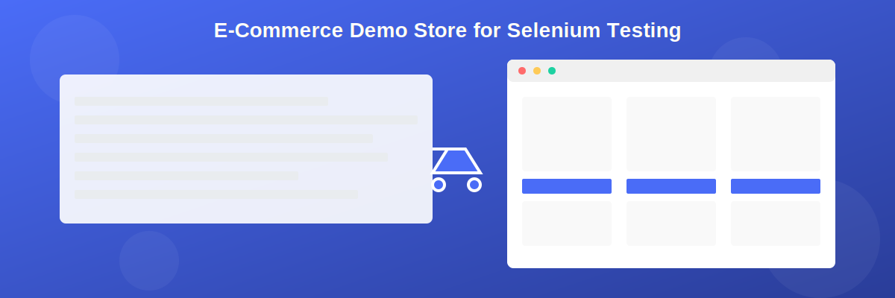

# E-Commerce Demo Store for Selenium Testing



## 🔗 Live Demo

**[https://demo-store.upcode.in/](https://demo-store.upcode.in/)**

## 📋 Overview

This project is a positive flow demo e-commerce web application specifically designed for practicing and enhancing Selenium automation testing skills. The application simulates real-world e-commerce scenarios with features like user authentication, product browsing, cart management, and checkout processes.

## ✨ Features

### 1. User Authentication
- Login functionality with hardcoded credentials:
  - Username: `admin`
  - Password: `admin`
- User registration form with field validations
- Session management (data clears upon logout)

### 2. Product Catalog
- Display of 20 products with images, names, and prices
- Pagination system (5 items per page)
- Product detail pages with comprehensive information
- Search and filter functionality

### 3. Shopping Cart
- Add products to cart from product list or detail pages
- Cart page displaying all added items with:
  - Individual product prices
  - Quantity controls
  - Subtotal calculation
- Tax calculation (12%)
- Additional delivery charge calculation
- Total cost display

### 4. Checkout Process
- Multiple payment options
- Order summary
- Success/Failure messages based on payment status

### 5. UI/UX Features
- Responsive design supporting various devices and screen sizes
- Intuitive navigation
- Clean and modern interface

## 🧪 Test Automation Use Cases

This application is ideal for practicing various Selenium test scenarios including:

1. **Authentication Testing**
   - Login validation
   - Registration form field validation
   - Session handling

2. **UI Interaction Testing**
   - Navigation between pages
   - Product selection
   - Image loading verification

3. **Form Handling**
   - Input field validation
   - Dropdown selection
   - Radio button & checkbox interaction

4. **Business Logic Testing**
   - Price calculation verification
   - Tax computation
   - Quantity update reflection

5. **End-to-End Flow Testing**
   - Complete purchase journey
   - Cart management
   - Checkout process

## 💻 Technical Details

- Static web application (no backend API calls)
- Data stored in browser cache
- Responsive design using CSS media queries
- Static image links from publicly available sources

## 🚀 Getting Started

### Prerequisites
- Any modern web browser
- Selenium WebDriver setup (for testing)

### Local Setup
1. Clone this repository
   ```
   git clone https://github.com/sujithps/demo-store.git
   ```
2. Navigate to the project directory
   ```
   cd demo-store
   ```
3. Open index.html in your browser or set up a local server

### For Selenium Testing
```python
# Sample Python code to start testing the application
from selenium import webdriver
from selenium.webdriver.common.by import By

# Initialize the driver
driver = webdriver.Chrome()
driver.get("https://demo-store.upcode.in/")

# Login test
username_field = driver.find_element(By.ID, "username")
password_field = driver.find_element(By.ID, "password")
login_button = driver.find_element(By.ID, "login-button")

username_field.send_keys("admin")
password_field.send_keys("admin")
login_button.click()

# Add more test scenarios as needed
```

## 🛠️ Technology Stack

- HTML5
- CSS3 (with media queries for responsiveness)
- JavaScript (ES6+)
- Local Storage API (for data persistence)

## 📝 License

This project is licensed under the MIT License - see the LICENSE file for details.

## 👥 Contributing

Contributions are welcome! Feel free to open issues or submit pull requests to enhance the application's features or fix bugs.


---

**Note:** This application is designed for educational purposes and testing practice. It does not process real payments or store actual user data.